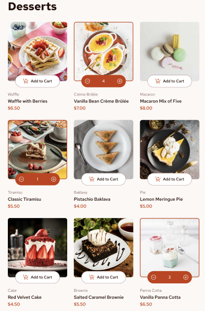
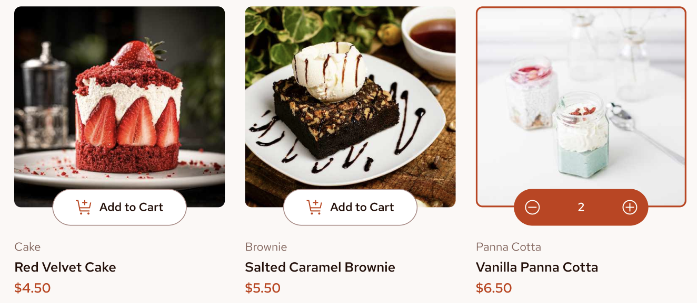
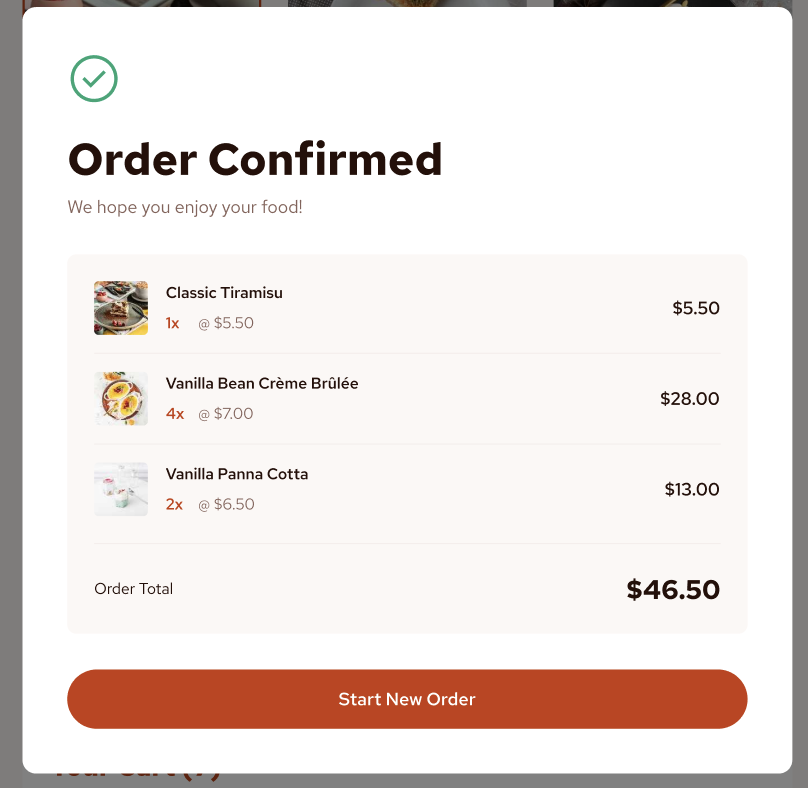

# 🍰 Dessert Ordering Website

An interactive and responsive dessert ordering website where users can browse desserts, add them to the cart, adjust quantities, and place orders.


## 🌐 Live Demo

> https://dessert-delights.vercel.app/

---

## 🚀 Technologies Used

- **HTML5** – semantic structure of the web pages
- **CSS3** – styling and responsive layout
- **Normalize.css** – consistent styling across browsers
- **JavaScript (ES6)** – interactivity, cart logic, dynamic updates
- **API Requests** – fetching and displaying dessert data dynamically

---

## ✨ Features

- 📌 **Dessert Cards** – Each dessert shows image, name, and price
- 🛒 **Add to Cart** – Add desserts with quantity control (`+` / `-`)
- 💰 **Live Price Calculation** – Cart updates total automatically
- ✅ **Order Confirmation Modal** – Overlay confirmation with order summary
- 📱 **Responsive Design** – Works seamlessly on desktop, tablet, and mobile
- 🎨 **Modern UI/UX** – Clean design with focus on usability

---

## 📸 Screenshots

### 🖼️ Home Page (Desserts Menu)



### 🛍️ Cart View



### ✅ Order Confirmation



## ⚙️ Installation & Setup

```bash
# Clone this repository
git clone https://github.com/khamzaevasad/dessert-delights

# Navigate into the project directory
cd dessert-ordering-site

# Open the index.html file in your browser
open index.html   # (or just double click the file)
```

📖 How It Works

The desserts are loaded dynamically (via API request or local dataset).

Users can browse desserts and click Add to Cart.

Inside the cart, users can increase or decrease quantities.

The total amount and price update automatically.

On checkout, an overlay modal displays the final order summary.

🛠️ Future Improvements

🔐 User Authentication (Login/Register)

🗄️ Backend Integration (save real orders in database)

💳 Payment Gateway Integration

🌙 Dark Mode support

🌐 Multi-language support

👨‍💻 Author

Asadbek – Web Developer & Student at Kangwon National University

📩 Feel free to reach out or contribute by opening issues and pull requests!
